<div align="center">

# Service Pay
### Dompet Digital Kampus — Aplikasi E-Money Berbasis Flutter

<i>Tugas Ujian Akhir Semester (UAS) — Aplikasi Mobile Lanjutan</i>

<br/>

[](https://flutter.dev)
[](https://dart.dev)
[](https://firebase.google.com)
[](https://bloclibrary.dev)
[](#-lisensi)

<a href="https://hitscounter.dev">
  
</a>

</div>

<br/>

> **Service Pay** adalah dompet digital (E-Money) yang dibangun dengan **Clean Architecture** + **BLoC**, dilengkapi keamanan berlapis (2FA & biometrik), pembayaran QR, serta integrasi *deep link* langsung ke merchant **DavPhone Service** — semuanya dirancang seperti alur e-wallet production-grade, bukan sekadar CRUD saldo.

<div align="center">

| 👤 Nama | 🆔 NIM | 🏫 Kelas | 📚 Mata Kuliah | 👨‍🏫 Dosen Pengampu |
|:---:|:---:|:---:|:---:|:---:|
| Dava Ananda Wahyudi | 1123150164 | TI23SE2P | Aplikasi Mobile Lanjutan | I Ketut Gunawan, S.Kom, M.T.I |

</div>

---

## 📋 Daftar Isi

- [Tentang Aplikasi](#-tentang-aplikasi)
- [Ekosistem Aplikasi](#-ekosistem-aplikasi)
- [Tech Stack](#-tech-stack)
- [Fitur Utama](#-fitur-utama)
- [Arsitektur Aplikasi](#-arsitektur-aplikasi)
- [Flow Integrasi Kedua Aplikasi](#-flow-integrasi-kedua-aplikasi)
- [Struktur Folder](#-struktur-folder)
- [Screenshot Aplikasi](#-screenshot-aplikasi)
- [Video Presentasi](#-video-presentasi)
- [Cara Menjalankan Project](#-cara-menjalankan-project)
- [Lisensi](#-lisensi)

---

## 💡 Tentang Aplikasi

**Service Pay** adalah aplikasi dompet digital (E-Money) berbasis Flutter yang dibangun dengan **Clean Architecture** dan **BLoC State Management**. Aplikasi ini dirancang untuk meniru alur kerja dompet digital di dunia nyata — bukan sekadar simulasi saldo — lengkap dengan transfer saldo, top-up, pembayaran via QR, autentikasi dua faktor (2FA), login biometrik, serta integrasi *seamless* dengan merchant **DavPhone Service** melalui mekanisme *Deep Linking*.

Proyek ini merupakan tugas akhir mata kuliah Aplikasi Mobile Lanjutan yang sengaja dibangun sebagai **dua aplikasi terpisah namun saling terhubung**, untuk mensimulasikan bagaimana penyedia layanan e-money sungguhan (seperti GoPay, OVO, atau ShopeePay) bisa digunakan sebagai metode pembayaran di aplikasi pihak ketiga:

```
Service Pay        ── dompet digital / penyedia layanan pembayaran
DavPhone Service    ── e-commerce toko HP & aksesori (merchant / pihak ketiga)
```

Kedua aplikasi berjalan independen (masing-masing punya backend, database, dan autentikasi sendiri), tetapi bisa saling berkomunikasi melalui *deep link* saat proses checkout — persis seperti bagaimana aplikasi e-commerce sungguhan mengarahkan pengguna ke aplikasi e-wallet untuk menyelesaikan pembayaran.

---

## 🌐 Ekosistem Aplikasi

Proyek ini terdiri dari **4 repository** yang membentuk satu ekosistem terintegrasi:

<div align="center">

| Komponen | Deskripsi | Repository |
|:---:|:---|:---:|
| 📱 Frontend E-Money | Aplikasi Flutter Service Pay *(Anda di sini)* | — |
| ⚙️ Backend E-Money | REST API layanan E-Money & mutasi saldo | [emoney_backend](https://github.com/annddvaa/emoney_backend) |
| 🛍️ Frontend DavPhone Service | Aplikasi Flutter toko HP & aksesori | [service_store](https://github.com/annddvaa/service_store_uts_1123150164) |
| 🗄️ Backend DavPhone Service | REST API berbasis Go + Gin + Firebase | [gin-firebase-backend](https://github.com/annddvaa/gin-firebase-backend) |

</div>

---

## 🧰 Tech Stack

<div align="center">


</div>

---

## ✨ Fitur Utama

<table>
<tr>
<td width="50%" valign="top">

**🔐 Autentikasi & Keamanan**
- Register & Login via Email/OTP atau akun Google (Firebase Auth)
- 2FA (*Two-Factor Authentication*) via kode SMTP Email atau aplikasi TOTP Authenticator, sebagai lapisan verifikasi tambahan saat login
- Login biometrik (fingerprint) untuk membuka aplikasi tanpa perlu mengetik ulang kredensial
- PIN transaksi 6 digit sebagai autentikasi akhir sebelum saldo terpotong

**💰 Keuangan**
- Tampilan saldo real-time yang langsung sinkron dengan backend
- Top-up saldo dengan beberapa metode
- Riwayat mutasi lengkap, mencatat setiap saldo masuk maupun keluar
- Transfer saldo ke sesama pengguna Service Pay melalui alur 3 langkah (pilih penerima → input nominal → konfirmasi)

</td>
<td width="50%" valign="top">

**🏪 Pembayaran & Integrasi Merchant**
- Scan QR untuk membayar langsung di merchant tanpa perlu input manual
- Integrasi *seamless* dengan merchant **DavPhone Service** melalui *Deep Link*, lengkap dengan layar konfirmasi tagihan sebelum saldo dipotong
- Callback otomatis kembali ke aplikasi merchant setelah transaksi selesai

**🔔 Pengalaman Pengguna**
- Notifikasi push transaksi real-time via Firebase Cloud Messaging
- Riwayat transaksi yang bisa ditelusuri kapan saja
- Halaman khusus promo & voucher untuk pengguna

</td>
</tr>
</table>

---

## 🏛️ Arsitektur Aplikasi

Kedua aplikasi dikembangkan menggunakan Dart + Flutter dengan pendekatan arsitektur berbeda, namun sama-sama mengusung prinsip **Separation of Concerns**.

### 1. Service Pay — Clean Architecture

```
┌────────────────────────────────────────────┐
│           Presentation Layer                │
│    (BLoC, Pages, Widgets)                    │
├────────────────────────────────────────────┤
│              Domain Layer                    │
│    (Entities, Use Cases, Repo Interface)     │
├────────────────────────────────────────────┤
│               Data Layer                     │
│    (Models, Datasources, Repo Impl)          │
└────────────────────────────────────────────┘
```

Setiap layer punya tanggung jawab yang jelas dan tidak saling bergantung secara langsung:

- **Presentation Layer** — menangani UI dan state management (BLoC). Layer ini hanya tahu cara menampilkan data, tidak tahu dari mana data itu berasal.
- **Domain Layer** — inti bisnis aplikasi, berisi *entity* murni dan *use case* (aturan bisnis seperti "transfer saldo tidak boleh melebihi saldo tersedia"). Layer ini tidak bergantung pada Flutter maupun package eksternal apa pun.
- **Data Layer** — implementasi nyata dari repository, termasuk pemanggilan API (via Dio) dan penyimpanan lokal (secure storage untuk token & data sensitif).

> Pendekatan ini cocok untuk aplikasi keuangan karena memberi keamanan tinggi (logika bisnis terisolasi dari UI), *testability* (setiap layer bisa diuji terpisah), dan kemudahan *maintenance* saat aplikasi berkembang.

### 2. DavPhone Service — Feature-First Architecture

```
features/
├── auth/         → Fitur autentikasi
├── cart/         → Keranjang belanja
├── checkout/     → Proses checkout
├── dashboard/    → Beranda & produk
├── orders/       → Riwayat pesanan
└── profile/      → Profil pengguna
```

Setiap folder di dalam `features/` adalah modul mandiri yang membungkus `data/`, `domain/`, dan `presentation/`-nya sendiri, sehingga satu fitur bisa dikembangkan atau diperbaiki tanpa menyentuh fitur lain.

> Pendekatan ini memudahkan iterasi cepat, cocok untuk aplikasi e-commerce yang fiturnya terus bertambah (promo, kategori produk baru, metode pembayaran lain, dsb).

---

## 🔄 Flow Integrasi Kedua Aplikasi

```
┌─────────────────────┐         Deep Link          ┌─────────────────────┐
│   DavPhone Service   │ ─────────────────────────► │     Service Pay      │
│   (service_store)    │                            │   (emoney_service)   │
│                       │ ◄───────────────────────── │                       │
└─────────────────────┘      Callback Deep Link     └─────────────────────┘
         │                                                    │
         ▼                                                    ▼
  Backend DavPhone                                    Backend E-Money
  (gin-firebase-backend)                              (emoney_backend)
```

**Alur lengkapnya:**

1. 🛒 **Eksplorasi & Checkout** — Pengguna belanja di DavPhone Service, pilih metode bayar *Service Pay*
2. 🔗 **Deep Link** — App `service_store` generate URL `dompetkampus://payment?...` dan membuka Service Pay
3. 🔒 **Verifikasi Biometrik** — Service Pay meminta autentikasi sidik jari jika app di background
4. 📋 **Konfirmasi Pembayaran** — Layar konfirmasi muncul berisi detail tagihan & info merchant
5. 🔑 **Input PIN** — Pengguna memasukkan PIN 6 digit sebagai autentikasi akhir
6. ⚡ **Proses Transaksi** — Backend E-Money memotong saldo (debit) & mengkredit merchant secara atomik
7. 🔙 **Callback** — Service Pay memanggil deep link callback, pengguna kembali ke DavPhone Service otomatis
8. ✅ **Status Update** — DavPhone Service me-refresh status pesanan menjadi *Dibayar / Diproses*

---

## 📂 Struktur Folder

<details>
<summary><b>📁 Klik untuk melihat struktur <code>lib/</code> — Service Pay (emoney_service)</b></summary>

```text
lib/
├── core/
│   ├── constants/          # API endpoints, app constants
│   ├── error/              # Exceptions & Failures
│   ├── network/             # API Client (Dio)
│   ├── router/               # App Router (go_router)
│   ├── services/             # Biometric, Deep Link, Notification
│   ├── theme/                # Colors, Text Styles, App Theme
│   └── utils/                # BLoC Observer, Formatters
├── data/
│   ├── datasources/
│   │   ├── local/            # Secure Storage
│   │   └── remote/           # Auth, Account, Payment, OTP APIs
│   ├── models/                # Account, Transaction, User Models
│   └── repositories/          # Repository Implementations
├── domain/
│   ├── entities/               # Account, OTP, Payment, Transaction, User
│   ├── repositories/            # Repository Interfaces
│   └── usecases/                 # Auth, Account, Payment Use Cases
├── injection/                     # Dependency Injection (get_it)
├── presentation/
│   ├── blocs/                      # Auth, Account, Payment BLoCs
│   ├── pages/
│   │   ├── auth/                    # Login, Register, 2FA, Verify Email
│   │   ├── home/                     # Home Page
│   │   ├── payment/                   # QR, Deep Link, PIN
│   │   ├── topup/                      # Top Up
│   │   ├── transfer/                    # Transfer (3 steps)
│   │   ├── history/                      # Riwayat Transaksi
│   │   ├── promo/                         # Promo
│   │   └── splash/                         # Splash Screen
│   └── widgets/                              # Reusable Widgets
└── main.dart
```

</details>

<details>
<summary><b>📁 Klik untuk melihat struktur <code>lib/</code> — DavPhone Service (service_store)</b></summary>

```text
lib/
├── core/
│   ├── constants/          # API, Color, Strings
│   ├── providers/           # Theme Provider
│   ├── routes/                # App Router
│   ├── services/                # Deep Link Handler, Dio, Secure Storage
│   └── theme/                     # App Theme
└── features/
    ├── auth/                       # Login, Register, Verify Email
    ├── cart/                        # Keranjang Belanja
    ├── checkout/                     # Proses Checkout & Pembayaran
    ├── dashboard/                      # Beranda, Produk, Detail Produk
    ├── orders/                          # Riwayat Pesanan
    └── profile/                          # Profil Pengguna
```

</details>

---

## 📱 Screenshot Aplikasi

> Screenshot diurutkan sesuai alur pemakaian sebenarnya — mulai dari **splash screen**, **autentikasi**, sampai **transaksi selesai** — untuk masing-masing aplikasi.

### 💳 Service Pay — Dompet Digital

<table>
<tr>
<td align="center" width="25%">
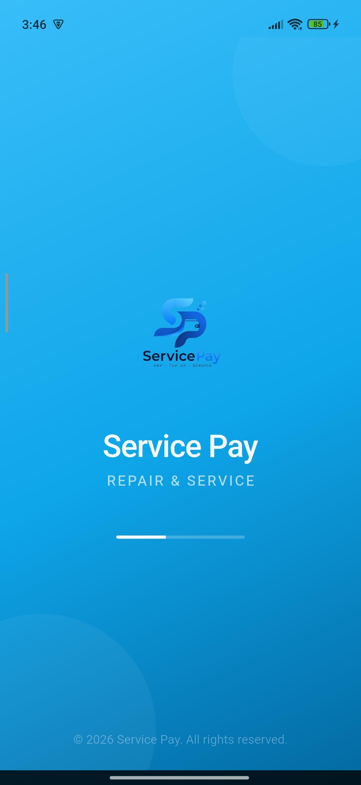<br/>
<sub><b>1. Splash Screen</b></sub>
</td>
<td align="center" width="25%">
<br/>
<sub><b>2. Halaman Awal — Buat Akun Baru / Masuk ke Akun</b></sub>
</td>
<td align="center" width="25%">
<br/>
<sub><b>3. Register — Buat Akun</b></sub>
</td>
<td align="center" width="25%">
<br/>
<sub><b>4. Login — Masuk ke Akun</b></sub>
</td>
</tr>
<tr>
<td align="center" width="25%">
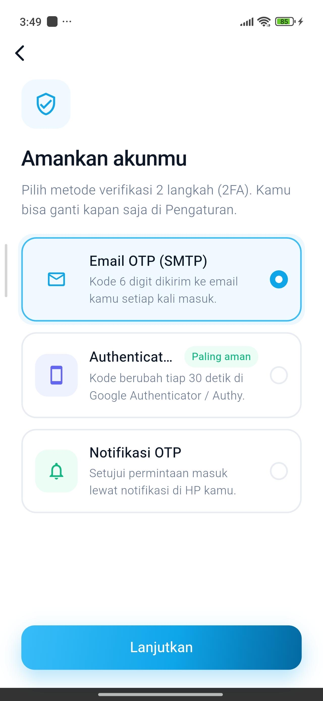<br/>
<sub><b>5. Pilih Metode Verifikasi 2FA</b></sub>
</td>
<td align="center" width="25%">
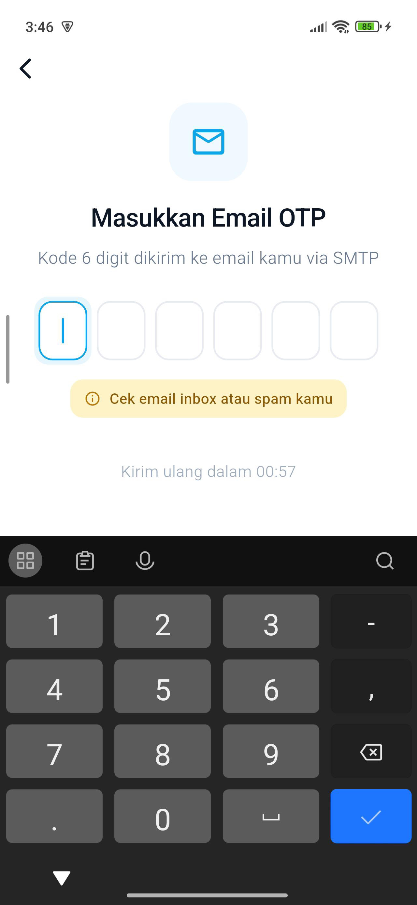<br/>
<sub><b>6. Verifikasi OTP via Email</b></sub>
</td>
<td align="center" width="25%">
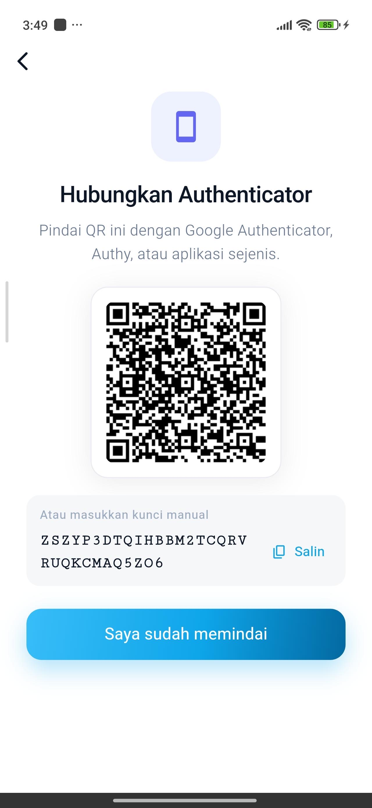<br/>
<sub><b>7. Hubungkan Authenticator (Scan QR)</b></sub>
</td>
<td align="center" width="25%">
<br/>
<sub><b>8. Masukkan Kode Authenticator (TOTP)</b></sub>
</td>
</tr>
<tr>
<td align="center" width="25%">
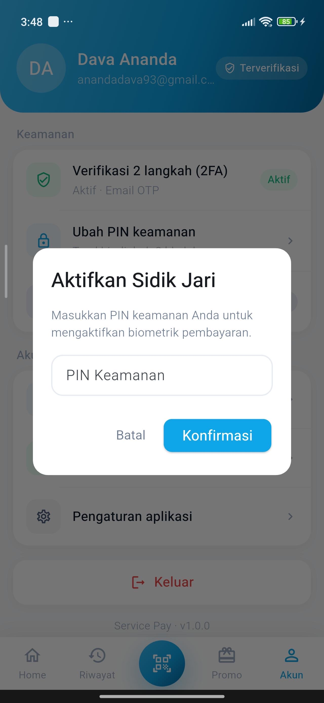<br/>
<sub><b>9. Aktifkan Login Biometrik</b></sub>
</td>
<td align="center" width="25%">
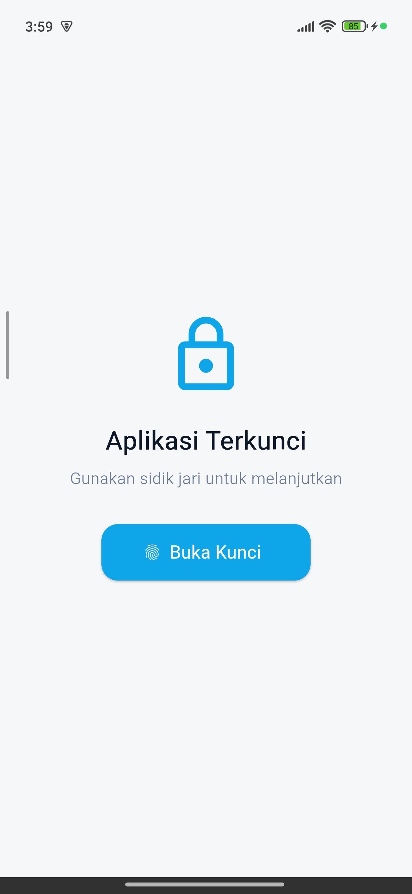<br/>
<sub><b>10. Aplikasi Terkunci — Buka dengan Sidik Jari</b></sub>
</td>
<td align="center" width="25%">
<br/>
<sub><b>11. Beranda — Saldo & Menu Utama</b></sub>
</td>
<td align="center" width="25%">
<br/>
<sub><b>12. Isi Saldo — Pilih Nominal & Metode</b></sub>
</td>
</tr>
<tr>
<td align="center" width="25%">
<br/>
<sub><b>13. Top Up Berhasil</b></sub>
</td>
<td align="center" width="25%">
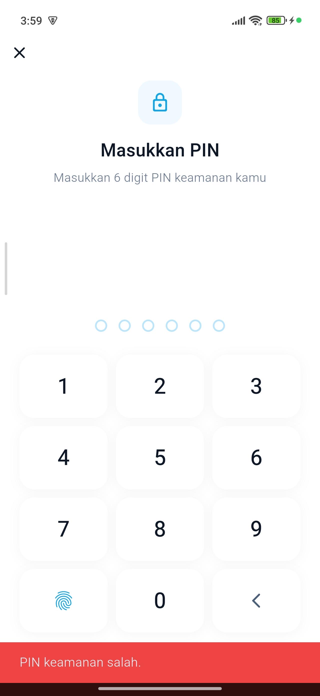<br/>
<sub><b>14. Masukkan PIN Transaksi</b></sub>
</td>
<td align="center" width="25%">
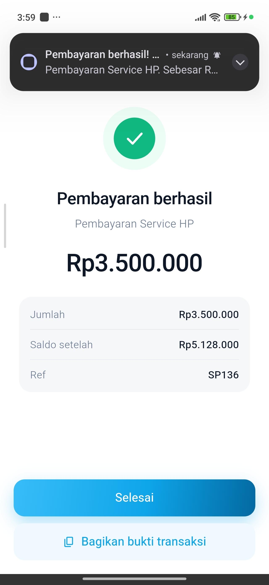<br/>
<sub><b>15. Pembayaran Berhasil</b></sub>
</td>
<td align="center" width="25%">
<br/>
<sub><b>16. Riwayat Transaksi</b></sub>
</td>
</tr>
<tr>
<td align="center" width="25%">
<br/>
<sub><b>17. Promo & Reward</b></sub>
</td>
<td align="center" width="25%">
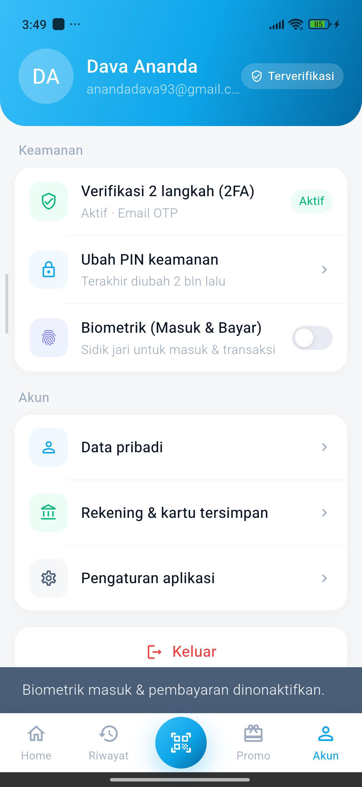<br/>
<sub><b>18. Pengaturan Keamanan Akun</b></sub>
</td>
<td align="center" width="25%">
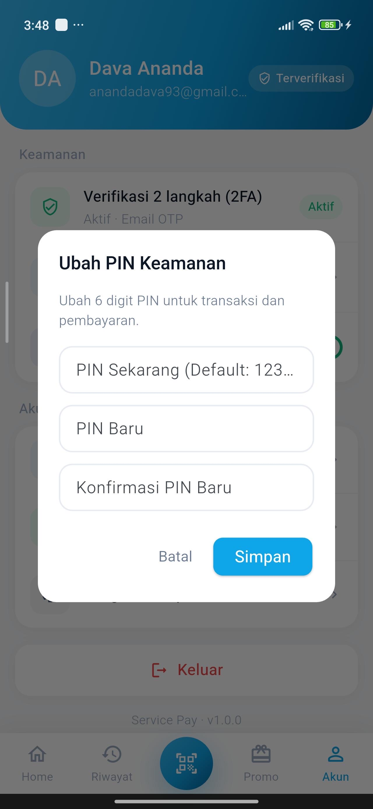<br/>
<sub><b>19. Ubah PIN Keamanan</b></sub>
</td>
<td align="center" width="25%">
<br/>
<sub><b>20. Menu Akun & Pengaturan</b></sub>
</td>
</tr>
<tr>
<td align="center" width="25%">
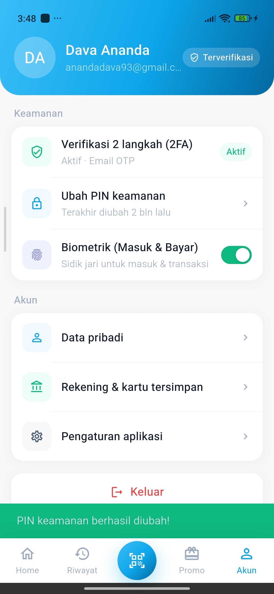<br/>
<sub><b>21. Pengaturan — Verifikasi 2 Langkah</b></sub>
</td>
<td align="center" width="25%">
<br/>
<sub><b>22. Biometrik Pembayaran Diaktifkan</b></sub>
</td>
</tr>
</table>

### 🛍️ DavPhone Service — Toko HP & Aksesori

<table>
<tr>
<td align="center" width="25%">
<br/>
<sub><b>1. Splash Screen — Memuat Aplikasi</b></sub>
</td>
<td align="center" width="25%">
<br/>
<sub><b>2. Splash Screen — Logo DavPhone</b></sub>
</td>
<td align="center" width="25%">
<br/>
<sub><b>3. Splash Screen — Logo DavPhone (2)</b></sub>
</td>
<td align="center" width="25%">
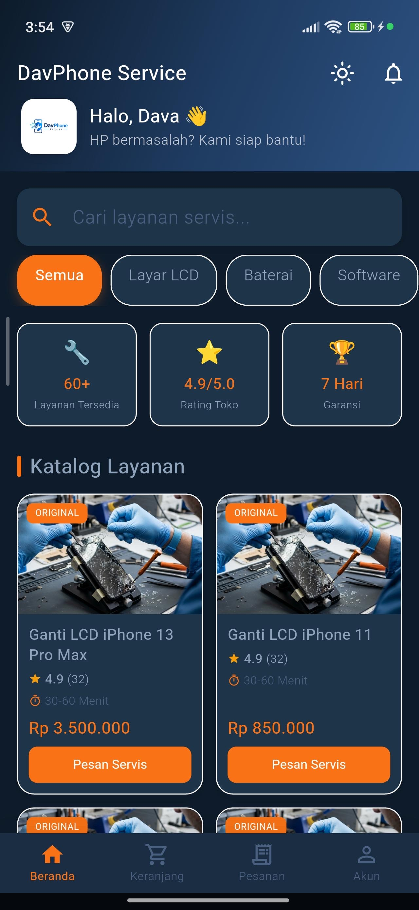<br/>
<sub><b>4. Splash Screen — DavPhone Service, Solusi Service HP Terpercaya</b></sub>
</td>
</tr>
<tr>
<td align="center" width="25%">
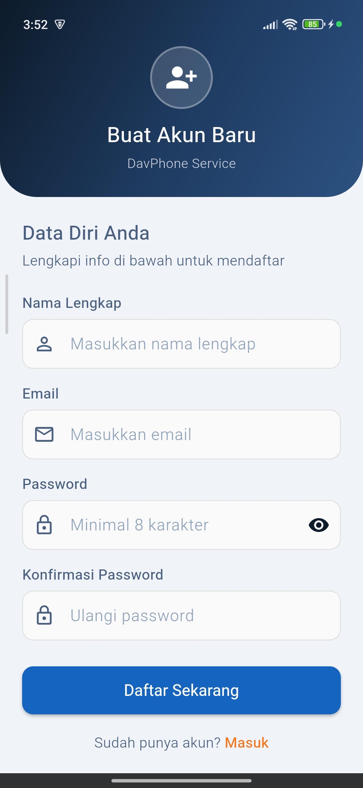<br/>
<sub><b>5. Register — Buat Akun Baru</b></sub>
</td>
<td align="center" width="25%">
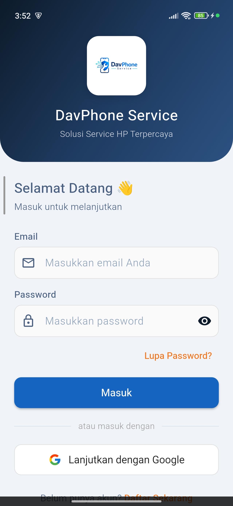<br/>
<sub><b>6. Login — Selamat Datang</b></sub>
</td>
<td align="center" width="25%">
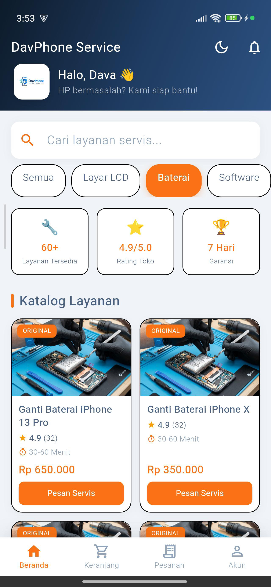<br/>
<sub><b>7. Beranda — Kategori Semua</b></sub>
</td>
<td align="center" width="25%">
<br/>
<sub><b>8. Beranda — Tampilan Awal</b></sub>
</td>
</tr>
<tr>
<td align="center" width="25%">
<br/>
<sub><b>9. Cari Layanan — Mengetik "Kamera"</b></sub>
</td>
<td align="center" width="25%">
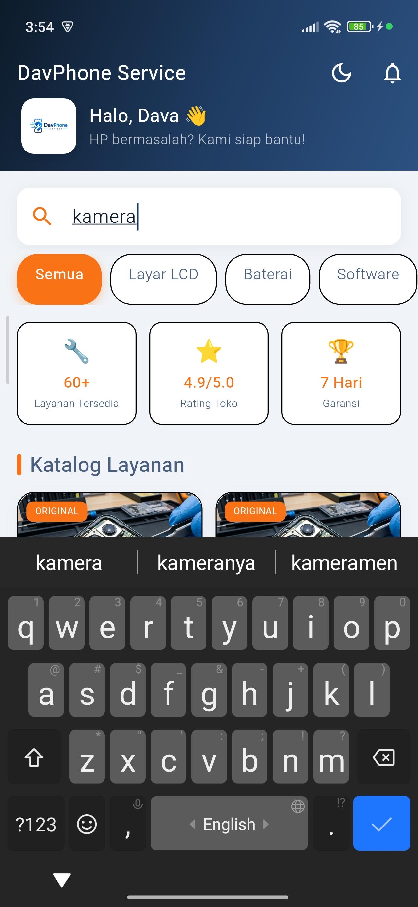<br/>
<sub><b>10. Cari Layanan — Hasil Pencarian "Kamera"</b></sub>
</td>
<td align="center" width="25%">
<br/>
<sub><b>11. Beranda — Kategori Kamera</b></sub>
</td>
<td align="center" width="25%">
<br/>
<sub><b>12. Beranda — Kategori Charging</b></sub>
</td>
</tr>
<tr>
<td align="center" width="25%">
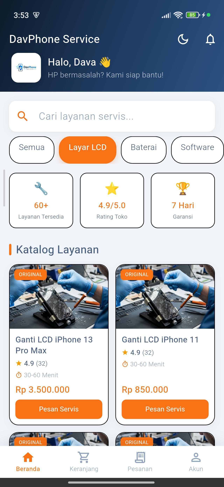<br/>
<sub><b>13. Beranda — Kategori Layar LCD</b></sub>
</td>
<td align="center" width="25%">
<br/>
<sub><b>14. Beranda — Kategori Komponen HP Lainnya</b></sub>
</td>
<td align="center" width="25%">
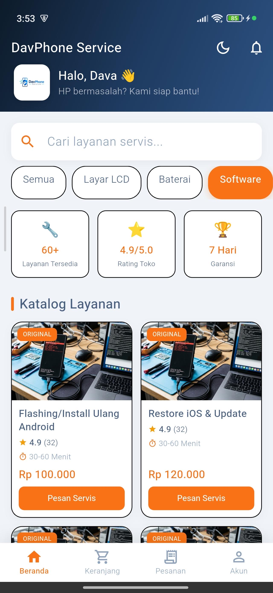<br/>
<sub><b>15. Beranda — Kategori Software</b></sub>
</td>
<td align="center" width="25%">
<br/>
<sub><b>16. Detail Layanan — Ganti LCD iPhone 13 Pro Max</b></sub>
</td>
</tr>
<tr>
<td align="center" width="25%">
<br/>
<sub><b>17. Detail Layanan — Tentang Layanan Ini</b></sub>
</td>
<td align="center" width="25%">
<br/>
<sub><b>18. Keranjang Servis — Kosong</b></sub>
</td>
<td align="center" width="25%">
<br/>
<sub><b>19. Keranjang Servis — Kosongkan Keranjang</b></sub>
</td>
<td align="center" width="25%">
<br/>
<sub><b>20. Checkout — Konfirmasi Pesanan & Pilih Metode Bayar</b></sub>
</td>
</tr>
<tr>
<td align="center" width="25%">
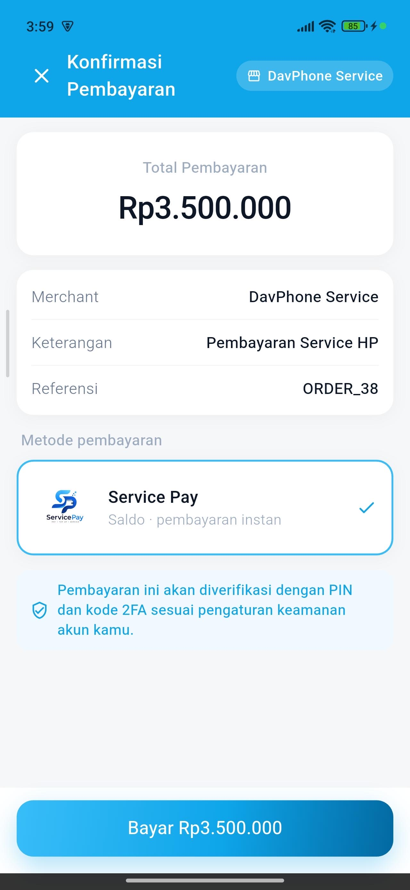<br/>
<sub><b>21. Konfirmasi Pembayaran (Deep Link ke Service Pay)</b></sub>
</td>
<td align="center" width="25%">
<br/>
<sub><b>22. Status Pesanan</b></sub>
</td>
<td align="center" width="25%">
<br/>
<sub><b>23. Akun Saya — Profil</b></sub>
</td>
</tr>
</table>

---

## 🎥 Video Presentasi

<div align="center">

[](https://youtu.be/1mOkUh0BSwM?si=ahTFgtn-wwjjTRuO)

</div>

Video ini berisi presentasi lengkap **Service Pay**, mulai dari penjelasan latar belakang, demo alur autentikasi (2FA & biometrik), transaksi (top-up, transfer, pembayaran QR), hingga integrasi *deep link* dengan merchant **DavPhone Service**.

> ✏️ **Catatan:** Video ini dibuat dengan penuh perjuangan (dan kopi tengah malam), jadi mohon ditonton sampai habis ya, Pak/Bu 🙏😄.

---

## 🚀 Cara Menjalankan Project

### Prasyarat

- ✅ Flutter SDK **≥ 3.0.0**
- ✅ Dart **≥ 3.0.0**
- ✅ Android Studio / VS Code
- ✅ Emulator Android atau perangkat fisik
- ✅ Backend E-Money sudah berjalan ([lihat repo](https://github.com/annddvaa/emoney_backend))

### Langkah-Langkah

```bash
# 1. Cek instalasi Flutter
flutter doctor

# 2. Clone repositori ini
git clone https://github.com/annddvaa/emoney_service.git
cd emoney_service

# 3. Install semua dependensi
flutter pub get

# 4. Jalankan aplikasi
flutter run
```

> ⚠️ **Penting:** Pastikan Backend E-Money sudah berjalan sebelum menjalankan aplikasi ini agar fitur API dapat berfungsi dengan baik.

---

## 📄 Lisensi

Proyek ini dibuat untuk keperluan akademik (Ujian Akhir Semester). Tidak untuk dipublikasikan atau digunakan secara komersial tanpa izin.

---

<div align="center">

Made with ❤️ using **Flutter** & **BLoC**

⭐ Jangan lupa beri bintang kalau project ini membantu!

<a href="https://hitscounter.dev">
  
</a>

</div>
